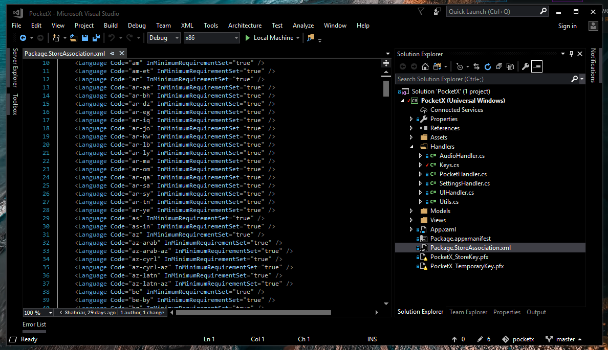
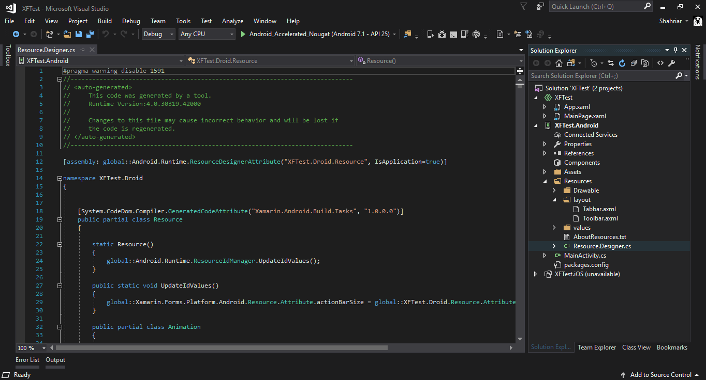

# My Visual Studio Themes
- **Installation: First Get [Color Theme Editor for Visual Studio 2017](https://marketplace.visualstudio.com/items?itemName=VisualStudioProductTeam.VisualStudio2017ColorThemeEditor) and then Import theme file `.vstheme`.**

- **Optional Extension for setting Background Image: [ClaudiaIDE](https://marketplace.visualstudio.com/items?itemName=kbuchi.ClaudiaIDE)**

## GreenShah
### [⏬ Get The Theme](https://github.com/yazdipour/VsTheme/raw/master/GreenShah/GreenShah.vstheme)

> \[Update\] GreenShah is now included in these extensions by default. 
> - [`Color Themes for Visual Studio Extension`](https://marketplace.visualstudio.com/items?itemName=JustinClareburtMSFT.ColorThemesforVisualStudio) 
> - [`Color Theme Editor for Visual Studio 2017 Extension`](https://marketplace.visualstudio.com/items?itemName=VisualStudioProductTeam.VisualStudio2017ColorThemeEditor)

## Hyper
### [⏬ Get The Theme](https://github.com/yazdipour/VsTheme/raw/master/Hyper/Hyper.vstheme)

## AsphaltShah
### [⏬ Get The Theme](https://github.com/yazdipour/VsTheme/raw/master/AsphaltShah/AsphaltShah.vstheme)

- [Microsoft Official Repository for Visual Studio Theme contributors](https://github.com/Microsoft/VS-ColorThemes/)
- [MIT License](https://github.com/yazdipour/GreenShah/blob/master/LICENSE)